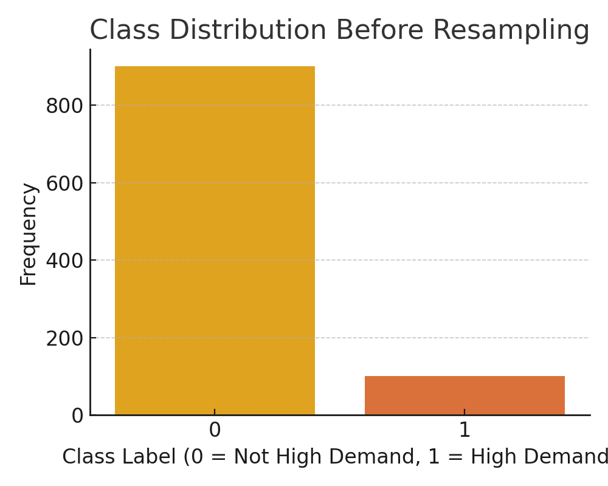
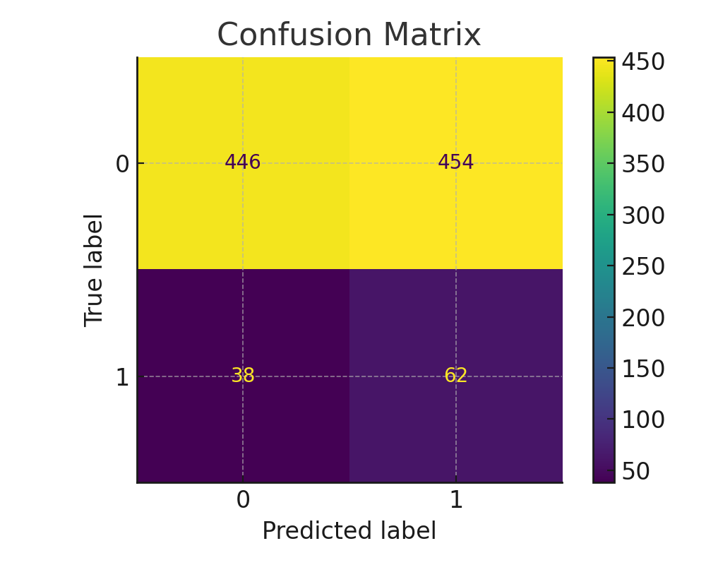
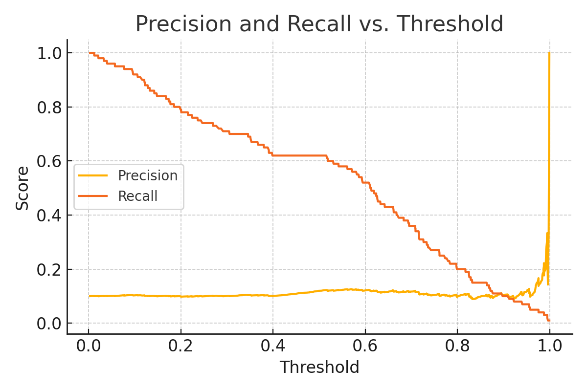

## Addressing Class Imbalance in High-Demand Electricity Load Prediction

While working on a classification model to predict high-demand electricity days in Alberta, I encountered an issue related to class imbalance. The target variable indicated whether a day’s peak electricity load fell in the top 10% of the distribution. This meant that only about 10% of the observations were labeled as "high demand," with the remaining 90% labeled as "not high demand".

<figure>
  
  <figcaption style="text-align: center;"><em>Figure 1: Class distribution showing the imbalance in high-demand vs. non-high-demand days.</em></figcaption>
</figure>

Initial model performance, evaluated using overall accuracy, appeared strong. However, further inspection revealed that very few high-demand days were being correctly predicted. Reviewing the confusion matrix and class-wise precision and recall scores confirmed that the model was favoring the majority class. This indicated a need to address the imbalance in the training data to improve classification performance on the minority class.

<figure style="text-align: center;>
  
  <figcaption style="text-align: center;"><em>Figure 2: Confusion matrix showing poor recall for the high-demand class before adjustments.</em></figcaption>
</figure>

To manage the imbalance, I tested both upsampling and downsampling techniques. In the upsampling approach, additional copies of minority class examples were added to the training set to increase representation. Downsampling, involves removing a portion of majority class examples to reduce the imbalance. Both methods resulted in improved recall on the high-demand class, though they affected model generalizability in different ways.

I also implemented threshold adjustment as an alternative strategy. I lowered the the default 0.5 classification threshold (eg. to 0.3) to allow the model to classify more borderline cases as high demand. This increased the number of correctly identified high-demand days, with a trade-off in precision that was acceptable for this use case.

<figure style="text-align: center;>
  
  <figcaption style="text-align: center;"><em>Figure 3: Precision and recall scores at varying probability thresholds.</em></figcaption>
</figure>

This process demonstrated the impact of class imbalance on classification models and the usefulness of sampling methods and threshold tuning for improving model performance in such cases. Incorporating these approaches allowed the model to better detect high-demand days, supporting more effective planning for electricity grid operations.
